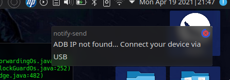
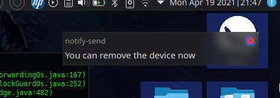
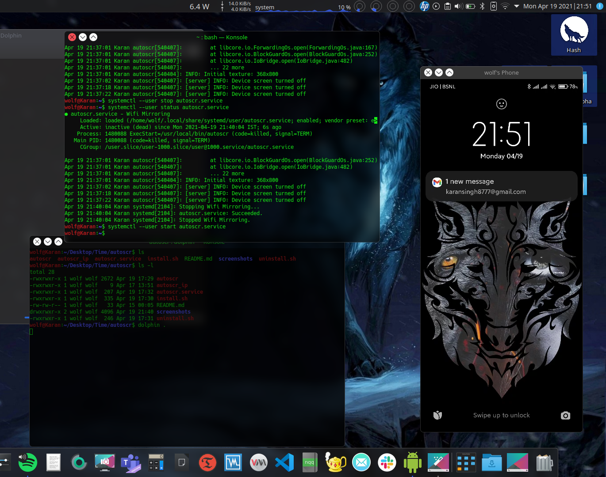

# autoscr
A simple shell script to automate scrcpy over tcpip. It is initiated on systemd user session. It prompts the user to connect using USB to restart ADB in TCP-IP mode but that is only when the phone is rebooted or wifi resets and the phone is assigned a new IP.
Alongside KDE Connect this script has become my ultimate productivity tool because I can leave my phone anywhere in the house and this will bring it over on my screen.

### Installation
Make sure that your system has zenity and notify-send
```
sudo apt install scrcpy zenity libnotify-bin
```
#### Run the installation script
```
git clone https://github.com/wolf-hash/autoscr.git
cd autoscr
./install.sh
```
### Screenshots
*prompt to connect USB if IP is not found*



*prompt to remove USB when connection is established*



*Device mirrored over TCP-IP*


